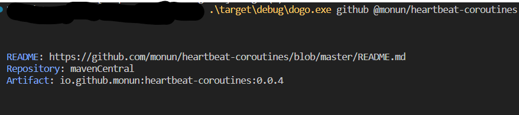

# dogo
Dependency Fetcher for Gradle

### What is Dogo
It fetches dependency information from github repositories

### How to use
1. Install Dogo

***Compile from source***
```bash
cargo install --path .
```

***Download binary***

Download binary from releases

2. Run command
```bash
dogo gradle @<owner>/<repo>

# or dogo gradle https://github.com/<owner>/<repo>
```

***Example***


